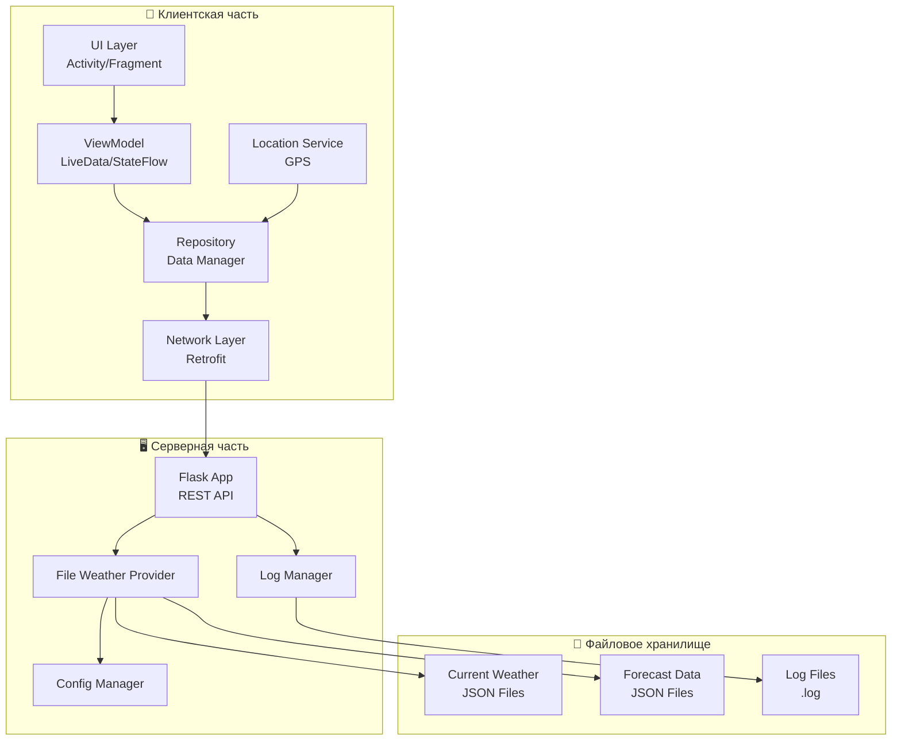

# WeatherForecast
Подготовлено в рамках дисциплины "Программирование мобильных устройств и встраиваемых систем"

## Разработчики
- Афонин Артем Александрович
- Бобриков Михаил Александрович
- Шилов Валерий Михайлович

## Учебная группа
АСУ-22-1б

## Тема
Мобильное приложение для анализа погодных условий

## План работ
1. Оформление требований по работе
2. Разработка серверной части (эмулятор Raspberry Pi)
3. Разработка клиентской части (Android приложение)
4. Интеграция клиента и сервера
5. Тестирование системы

## Требования
### Клиент
1. Отображение текущей погоды: температура, условия, влажность, скорость и направление ветра (по возомжности реализовать отображение всех указанных характеристик)
2. Прогноз по часам и дням
3. Загрузка и отображение иконок погоды

### Сервер (Модель)
1. Получение данных о погоде из OpenWeatherMap API
2. Предоставление данных клиенту через REST API
3. Обработка и форматирование данных погоды

## Репозиторий
https://github.com/aafonin04/WeatherForecast

# Архитектура системы
## Общая архитектура приложения

Схема представляет высокоуровневый обзор всей системы, показывая взаимодействие между основными компонентами. Демонстрирует разделение на клиентскую часть (Android приложение), серверную часть (Flask на Raspberry Pi) и файловое хранилище. Стрелки показывают направление потоков данных: от мобильного устройства через сетевые запросы к серверу, который в свою очередь взаимодействует с файловой системой для чтения погодных данных и записи логов.

**Клиентская часть (Android):**

- UI Layer (Activity/Fragment) - отвечает за отображение пользовательского интерфейса и обработку пользовательских жестов.
- ViewModel (LiveData/StateFlow) - управляет данными для UI, обеспечивает реактивное обновление интерфейса.
- Repository (Data Manager) - центральный point для управления данными, объединяет локальные и удаленные источники.
- Network Layer (Retrofit) - выполняет HTTP-запросы к серверу, сериализует/десериализует JSON.
- Location Service (GPS) - получает текущие координаты устройства через GPS или сетевые провайдеры.

**Серверная часть (Flask + Raspberry Pi):**

- Flask App (REST API) - обрабатывает входящие HTTP-запросы, маршрутизирует к соответствующим обработчикам.
- File Weather Provider - управляет чтением погодных данных из файловой системы, добавляет вариативность.
- Log Manager - отвечает за запись логов и статистики использования.
- Config Manager - управляет настройками приложения, путями к файлам.

**Файловое хранилище:**

- Current Weather JSON Files - хранят эмулированные данные о текущей погоде для разных локаций.
- Forecast Data JSON Files - содержат прогнозы погоды по часам и дням.
- Log Files (.log) - текстовые файлы с историей запросов и ошибок.
