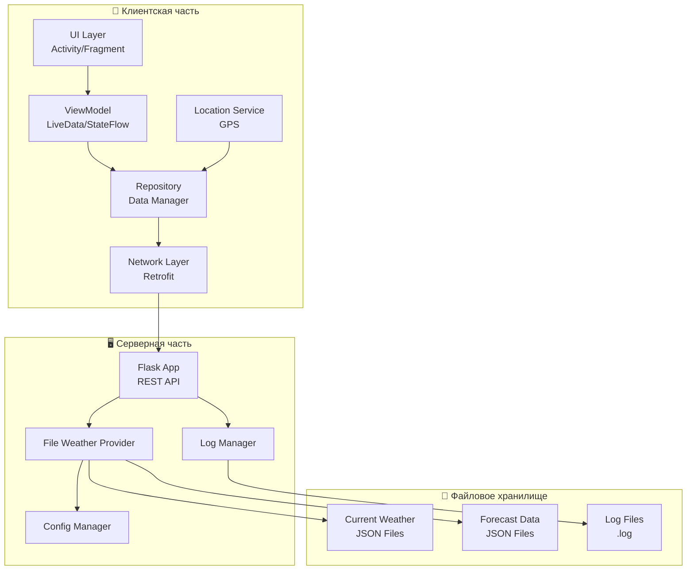
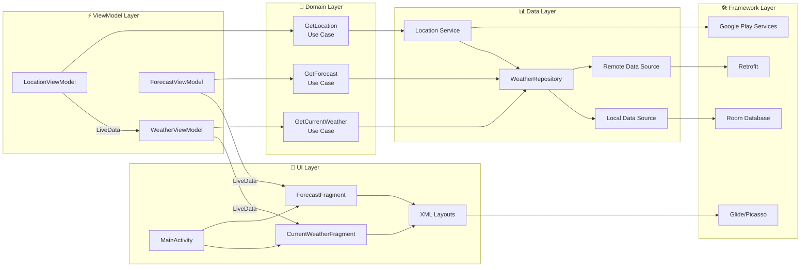
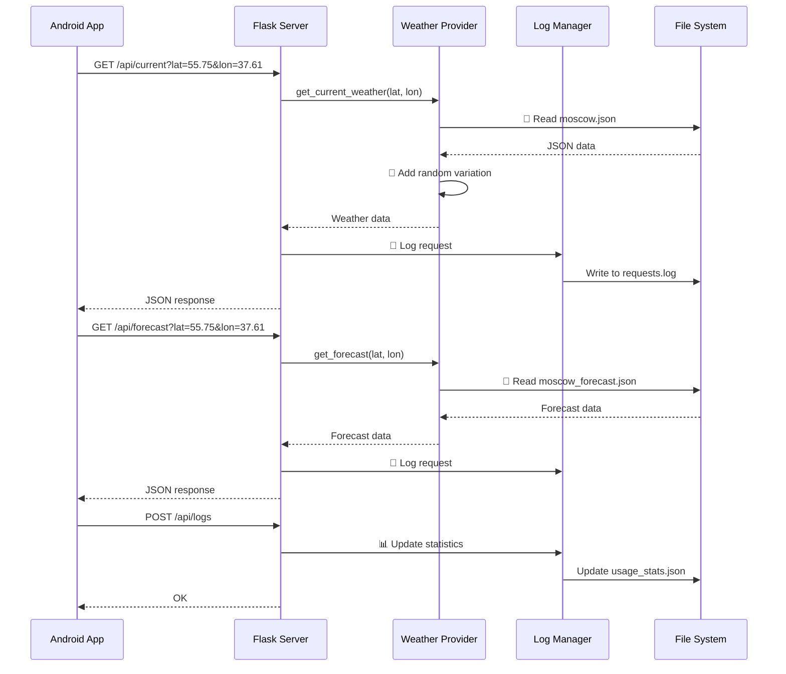
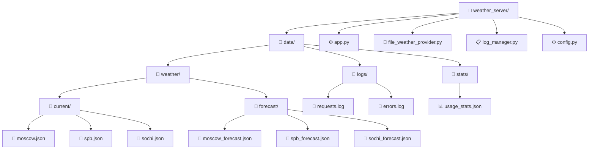

# WeatherForecast
Подготовлено в рамках дисциплины "Программирование мобильных устройств и встраиваемых систем"

## Разработчики
- Афонин Артем Александрович
- Бобриков Михаил Александрович
- Шилов Валерий Михайлович

## Учебная группа
АСУ-22-1б

## Тема
Мобильное приложение для анализа погодных условий

## План работ
1. Оформление требований по работе
2. Разработка серверной части (эмулятор Raspberry Pi)
3. Разработка клиентской части (Android приложение)
4. Интеграция клиента и сервера
5. Тестирование системы

## Требования
### Клиент
1. Отображение текущей погоды: температура, условия, влажность, скорость и направление ветра (по возомжности реализовать отображение всех указанных характеристик)
2. Прогноз по часам и дням
3. Загрузка и отображение иконок погоды

### Сервер (Модель)
1. Получение данных о погоде из OpenWeatherMap API
2. Предоставление данных клиенту через REST API
3. Обработка и форматирование данных погоды

## Репозиторий
https://github.com/aafonin04/WeatherForecast

# Архитектура системы
## Общая архитектура приложения

Схема представляет высокоуровневый обзор всей системы, показывая взаимодействие между основными компонентами. Демонстрирует разделение на клиентскую часть (Android приложение), серверную часть (Flask на Raspberry Pi) и файловое хранилище. Стрелки показывают направление потоков данных: от мобильного устройства через сетевые запросы к серверу, который в свою очередь взаимодействует с файловой системой для чтения погодных данных и записи логов.

**Клиентская часть (Android):**

- UI Layer (Activity/Fragment) - отвечает за отображение пользовательского интерфейса и обработку пользовательских жестов.
- ViewModel (LiveData/StateFlow) - управляет данными для UI, обеспечивает реактивное обновление интерфейса.
- Repository (Data Manager) - центральный point для управления данными, объединяет локальные и удаленные источники.
- Network Layer (Retrofit) - выполняет HTTP-запросы к серверу, сериализует/десериализует JSON.
- Location Service (GPS) - получает текущие координаты устройства через GPS или сетевые провайдеры.

**Серверная часть (Flask + Raspberry Pi):**

- Flask App (REST API) - обрабатывает входящие HTTP-запросы, маршрутизирует к соответствующим обработчикам.
- File Weather Provider - управляет чтением погодных данных из файловой системы, добавляет вариативность.
- Log Manager - отвечает за запись логов и статистики использования.
- Config Manager - управляет настройками приложения, путями к файлам.

**Файловое хранилище:**

- Current Weather JSON Files - хранят эмулированные данные о текущей погоде для разных локаций.
- Forecast Data JSON Files - содержат прогнозы погоды по часам и дням.
- Log Files (.log) - текстовые файлы с историей запросов и ошибок.

## Детальная архитектура Android приложения (MVVM)

Схема детализирует архитектуру мобильного приложения по паттерну MVVM (Model-View-ViewModel). Показывает четкое разделение на слои: UI слой отвечает за отображение, ViewModel управляет данными с учетом жизненного цикла, Domain слой содержит бизнес-логику, Data слой управляет источниками данных, а Framework слой предоставляет доступ к платформенным возможностям. Иллюстрируется принцип однонаправленного потока данных.

**UI Layer:**
- MainActivity - корневая активность, управляет навигацией между фрагментами.
- CurrentWeatherFragment - отображает текущую погоду: температуру, влажность, ветер и др.
- ForecastFragment - показывает прогноз погоды по часам и дням.
- XML Layouts - определяют визуальное представление, разметку элементов.

**ViewModel Layer:**
- WeatherViewModel - хранит и управляет данными о текущей погоде, предоставляет LiveData для UI.
- ForecastViewModel - управляет данными прогноза, обрабатывает обновления.
- LocationViewModel - координирует получение и обработку геолокации.

**Domain Layer:**
- GetCurrentWeather Use Case - инкапсулирует бизнес-логику получения текущей погоды.
- GetForecast Use Case - содержит логику получения прогноза погоды.
- GetLocation Use Case - управляет процессом получения местоположения.

**Data Layer:**
- WeatherRepository - единая точка доступа к данным.
- Local Data Source - управляет локальным хранением (Room/SQLite).
- Remote Data Source - отвечает за сетевые запросы к серверу.
- Location Service - абстракция над системными сервисами локации.

**Framework Layer:**
- Retrofit - выполняет HTTP-запросы, конвертирует JSON в Java объекты.
- Room Database - предоставляет абстракцию над SQLite для локального хранения.
- Google Play Services - обеспечивает доступ к системным сервисам (локация).
- Glide/Picasso - загружает и кэширует изображения иконок погоды.

## Схема работы серверной части

Диаграмма последовательности, которая визуализирует временную последовательность взаимодействия между компонентами при обработке запросов. Показывает полный цикл: от инициации запроса в Android приложении до возврата данных, включая промежуточные шаги (обработка в Flask, чтение файлов, логирование).

**Участники взаимодействия:**
- Android App - инициатор запросов, отображает конечные данные пользователю.
- Flask Server - принимает запросы, координирует обработку, возвращает ответы.
- Weather Provider - бизнес-логика работы с погодными данными.
- Log Manager - сервис логирования запросов и ошибок.
- File System - физическое хранилище данных на Raspberry Pi.

**Процесс обработки запроса:**
- GET /api/current - запрос текущей погоды с координатами.
- get_current_weather() - вызов бизнес-логики для обработки.
- Read JSON file - чтение эмулированных данных из файла.
- Add random variation - добавление случайности для имитации реальных данных.
- Log request - запись информации о запросе.
- JSON response - возврат структурированных данных клиенту.

## Структура файлового хранилища

Иерархическая схема, отображающая организацию файлов и директорий в проекте. Показывает логическую структуру хранения данных: отдельные папки для текущей погоды, прогнозов и логов. Демонстрирует принцип разделения данных по типам и назначению, что упрощает управление и доступ к информации.

**Корневая директория weather_server/:**
- app.py - основной файл Flask приложения, точка входа;
- file_weather_provider.py - модуль для работы с файлами погодных данных;
- log_manager.py - управление системой логирования;
- config.py - конфигурационные параметры приложения.

**Директория data/:**
- weather/current/ - JSON файлы с текущей погодой для разных городов;
- weather/forecast/ - JSON файлы с прогнозами погоды;
- logs/requests.log - журнал всех входящих запросов;
- logs/errors.log - журнал ошибок и исключений.

**Файлы данных:**
- moscow.json, spb.json, sochi.json и пр. - содержат эмулированные данные для конкретных локаций.

Формат JSON - обеспечивает человеко-читаемость и простоту редактирования.

